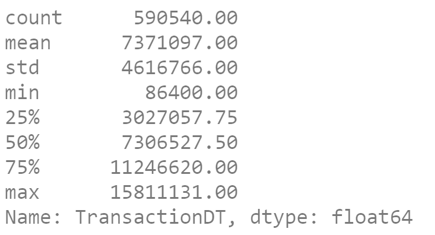
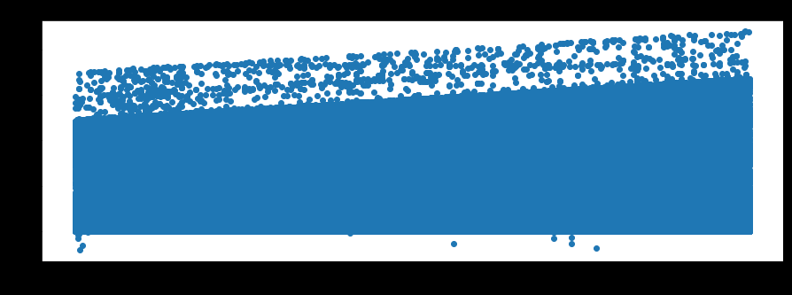

# Data Description
## Labeling logic
- "The logic of our labeling is define reported chargeback on the card as fraud transaction (isFraud=1) and transactions posterior to it with either user account, email address or billing address directly linked to these attributes as fraud too. If none of above is reported and found beyond 120 days, then we define as legit transaction (isFraud=0).
- However, in real world fraudulent activity might not be reported, e.g. cardholder was unaware, or forgot to report in time and beyond the claim period, etc. In such cases, supposed fraud might be labeled as legit, but we never could know of them. Thus, we think they're unusual cases and negligible portion." 

## Transaction Table 
- **394 cols = TransactionID + isFraud + 392 cols**
- It contains money transfer and also other gifting goods and service, like you booked a ticket for others, etc.
1. **TransactionDT**: timedelta from a given reference datetime (not an actual timestamp)
    - TransactionDT first value is 86400, which corresponds to the number of seconds in a day (60 * 60 * 24 = 86400).
        - 
        - The unit is seconds.
        - The data spans 6 months, as the maximum value is 15811131, which would correspond to day 183.
2. **TransactionAMT**: transaction payment amount in USD
    - Transaction payment amount in USD.
    - Is it possible that these are foreign transactions and that, for example, the 75.887 in row 12 is the result of multiplying a foreign currency amount by an exchange rate?”
        - .png)
3. **ProductCD** (`Categorical`): product code, the product for each transaction
    - “Product isn't necessary to be a real 'product' (like one item to be added to the shopping cart). It could be any kind of service.”
4. **card1 - card6** (`Categorical`): payment card information, such as card type, card category, issue bank, country, etc.
5. **addr1, 2** (`Categorical`): address
    - “both addresses are for purchaser addr1 as billing region, addr2 as billing country”
6. **dist1, 2**: distance
    - "distances between (not limited) billing address, mailing address, zip code, IP address, phone area, etc.”
7. **P_ and (R__) emaildomain** (`Categorical`): purchaser and recipient email domain
8. **C1-C14**: counting, such as how many addresses are found to be associated with the payment card, etc. The actual meaning is masked.
    - device, ipaddr, billingaddr, etc. Also these are for both purchaser and recipient, which doubles the number.
9. **D1-D15**: timedelta, such as days between previous transaction, etc.
10. **M1-M9** (`Categorical`): match, such as names on card and address, etc.
11. **V1-V339**: Vesta engineered rich features, including ranking, counting, and other entity relations.
    - “For example, how many times the payment card associated with a IP and email or address appeared in 24 hours time range, etc.”
    - All Vesta features were derived as numerical. some of them are count of orders within a clustering, a time-period or condition, so the value is finite and has ordering (or ranking).
    -  I wouldn't recommend to treat any of them as categorical. If any of them resulted in binary by chance, it maybe worth trying."


## Identity Table 
- **41 cols = TransactionID + 40 cols**
- Variables in this table are identity information – network connection information (IP, ISP, Proxy, etc) and digital signature (UA/browser/os/version, etc) associated with transactions.
- They're collected by Vesta’s fraud protection system and digital security partners.
1. **id_1 - id_11**
    - numerical features for identity.
    - device rating, ip_domain rating, proxy rating, etc. 
    - Also it recorded behavioral fingerprint like account login times/failed to login times, how long an account stayed on the page, etc.
    - I hope you could get basic meaning of these features, and by mentioning them as numerical/categorical, you won't deal with them inappropriately.”
2. **id_12 - id_38** (`Categorical`)
3. **DeviceType** (`Categorical`)
4. **DevideInfo** (`Categorical`)

---
# Feature Engineering
 First you think of an idea and create a new feature. Then you add it to your model and evaluate whether local validation AUC increases or decreases. If AUC increases keep the feature, otherwise discard the feature.
## Normalize / Standardize
The D Columns are "time deltas" from some point in the past. We will transform the D Columns into their point in the past. 
- x: Time, y: D15


```python
for i in range(1,16):
    if i in [1,2,3,5,9]: continue
    X_train['D'+str(i)] =  X_train['D'+str(i)] - X_train.TransactionDT/np.float32(24*60*60)
    X_test['D'+str(i)] = X_test['D'+str(i)] - X_test.TransactionDT/np.float32(24*60*60) 
```
## NAN processing
- If you give `np.nan` to LGBM, then at each tree node split, it will split the non-NAN values and then send all the NANs to either the left child or right child depending on what’s best. 
- Therefore NANs get special treatment at every node and can become overfit. 
- **Convert all NAN to a negative number lower (eg. -1) than all non-NAN values!**
- Then LGBM will no longer overprocess NAN. Instead it will give it the same attention as other numbers.
## Label Encode/ Factorize/ Memory reduction
Label encoding (factorizing) converts a (string, category, object) column to integers. 
- Factorizing reduces memory and turns NAN into a number (i.e. -1) which affects CV and LB.
- Additionally for memory reduction, people use the popular `memory_reduce` function on the other columns. A simpler and safer approach is to convert all float64 to float32 and all int64 to int32.

```python
%%time
# LABEL ENCODE AND MEMORY REDUCE
for i,f in enumerate(X_train.columns):
    # FACTORIZE CATEGORICAL VARIABLES
    if (np.str(X_train[f].dtype)=='category')|(X_train[f].dtype=='object'): 
        df_comb = pd.concat([X_train[f],X_test[f]],axis=0)
        df_comb,_ = df_comb.factorize(sort=True)
        if df_comb.max()>32000: print(f,'needs int32')
        X_train[f] = df_comb[:len(X_train)].astype('int16')
        X_test[f] = df_comb[len(X_train):].astype('int16')
        
    # SHIFT ALL NUMERICS POSITIVE. SET NAN to -1
    elif f not in ['TransactionAmt','TransactionDT']:
        mn = np.min((X_train[f].min(),X_test[f].min()))
        X_train[f] -= np.float32(mn)
        X_test[f] -= np.float32(mn)
        X_train[f].fillna(-1,inplace=True)
        X_test[f].fillna(-1,inplace=True)

```
``` python
# LABEL ENCODE
def encode_LE(col,train=X_train,test=X_test,verbose=True):
    df_comb = pd.concat([train[col],test[col]],axis=0)
    df_comb,_ = df_comb.factorize(sort=True)
    nm = col
    if df_comb.max()>32000: 
        train[nm] = df_comb[:len(train)].astype('int32')
        test[nm] = df_comb[len(train):].astype('int32')
    else:
        train[nm] = df_comb[:len(train)].astype('int16')
        test[nm] = df_comb[len(train):].astype('int16')
    del df_comb; x=gc.collect()
    if verbose: print(nm,', ',end='')
```

## Frequency Encoding
Frequency encoding is a powerful technique that allows LGBM to see whether column values are rare or common.
- For example, if you want LGBM to "see" which credit cards are used infrequently.

``` python
# FREQUENCY ENCODE TOGETHER
def encode_FE(df1, df2, cols):
    for col in cols:
        df = pd.concat([df1[col],df2[col]])
        vc = df.value_counts(dropna=True, normalize=True).to_dict()
        vc[-1] = -1
        nm = col+'_FE'
        df1[nm] = df1[col].map(vc)
        df1[nm] = df1[nm].astype('float32')
        df2[nm] = df2[col].map(vc)
        df2[nm] = df2[nm].astype('float32')
        print(nm,', ',end='')
```
The feature here adds to each row what the average `TransactionAmt` is for that row's `card1` group. Therefore LGBM can now tell if a row has an abnormal `TransactionAmt` for their `card1` group.

## Aggregations / Group Statistics
Providing LGBM with group statistics allows LGBM to determine if a value is common or rare for a particular group.
- You calculate group statistics by providing pandas with 3 variables. You give it the group, variable of interest, and type of statistic. For example,
``` python
temp = df.groupby('card1')['TransactionAmt'].agg(['mean'])   
    .rename({'mean':'TransactionAmt_card1_mean'},axis=1)
df = pd.merge(df,temp,on='card1',how='left')
```

``` python
# GROUP AGGREGATION MEAN AND STD
# https://www.kaggle.com/kyakovlev/ieee-fe-with-some-eda
def encode_AG(main_columns, uids, aggregations=['mean'], train_df=X_train, test_df=X_test, 
              fillna=True, usena=False):
    # AGGREGATION OF MAIN WITH UID FOR GIVEN STATISTICS
    for main_column in main_columns:  
        for col in uids:
            for agg_type in aggregations:
                new_col_name = main_column+'_'+col+'_'+agg_type
                temp_df = pd.concat([train_df[[col, main_column]], test_df[[col,main_column]]])
                if usena: temp_df.loc[temp_df[main_column]==-1,main_column] = np.nan
                temp_df = temp_df.groupby([col])[main_column].agg([agg_type]).reset_index().rename(
                                                        columns={agg_type: new_col_name})

                temp_df.index = list(temp_df[col])
                temp_df = temp_df[new_col_name].to_dict()   

                train_df[new_col_name] = train_df[col].map(temp_df).astype('float32')
                test_df[new_col_name]  = test_df[col].map(temp_df).astype('float32')
                
                if fillna:
                    train_df[new_col_name].fillna(-1,inplace=True)
                    test_df[new_col_name].fillna(-1,inplace=True)
                
                print("'"+new_col_name+"'",', ',end='')
```
## Combining / Transforming / Interaction
Two (string or numeric) columns can be combined into one column. For example `card1` and `card2` can become a new column with 
``` python
df['uid'] = df[‘card1’].astype(str)+’_’+df[‘card2’].astype(str)
```
- This helps LGBM because by themselves card1 and card2 may not correlate with target and therefore LGBM won’t split them at a tree node.
- But the interaction `uid = card1_card2` may correlate with target and now LGBM will split it.
- Numeric columns can combined with adding, subtracting, multiplying, etc. A numeric example is

``` python
df['x1_x2'] = df['x1'] * df['x2']
``` 

``` python
# COMBINE FEATURES
def encode_CB(col1,col2,df1=X_train,df2=X_test):
    nm = col1+'_'+col2
    df1[nm] = df1[col1].astype(str)+'_'+df1[col2].astype(str)
    df2[nm] = df2[col1].astype(str)+'_'+df2[col2].astype(str) 
    encode_LE(nm,verbose=False)
    print(nm,', ',end='')
```
## Reducing the number of V columns
- The V columns appear to be redundant and correlated.
- For each block of V columns with similar NAN structure, we could find subsets within the block that are correlated (r > 0.75).
- Replace the entire block with one column from each subset.
- For example in block V1-V11, we see that the subsets [[1],[2,3],[4,5],[6,7],[8,9],[10,11]] exist and we can choose [1, 3, 4, 6, 8, 11] to represent the V1-V11 block without losing that much information.
- Alternatively you could apply PCA on each block, but this subset reduce method performed better.

## Outlier Removal / Relax / Smooth / PCA
Normally you want to remove anomalies from your data because they confuse your models. However in this competition, we want to find anomalies so use smoothing techniques carefully. The idea behind these methods is to determine and remove uncommon values. For example, by using frequency encoding of a variable, you can remove all values that appear less than 0.1% by replacing them with a new value like -9999 (note that you should use a different value than what you used for NAN).

## Feature Selections
- forward feature selection (using single or groups of features)
- recursive feature elimination (using single or groups of features)
- permutation importance
- adversarial validation
- correlation analysis
- time consistency
- client consistency
- train/test distribution analysis

## How to find UIUDs


<details><summary>Reference</summary>
<p>

- [Data description](https://www.kaggle.com/c/ieee-fraud-detection/discussion/101203)

- [1st Notebook](https://www.kaggle.com/cdeotte/xgb-fraud-with-magic-0-9600#Normalize-D-Columns)

- [Feature Engineering Techniques](https://www.kaggle.com/c/ieee-fraud-detection/discussion/108575#latest-641841)

- [EDA for Columns V and ID](https://www.kaggle.com/cdeotte/eda-for-columns-v-and-id#V1-V11,-D11)

- [How to find UIUDs](https://www.kaggle.com/c/ieee-fraud-detection/discussion/111510)

</p>
</details>
